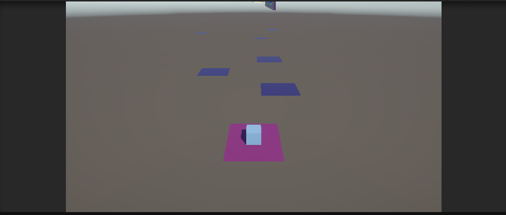
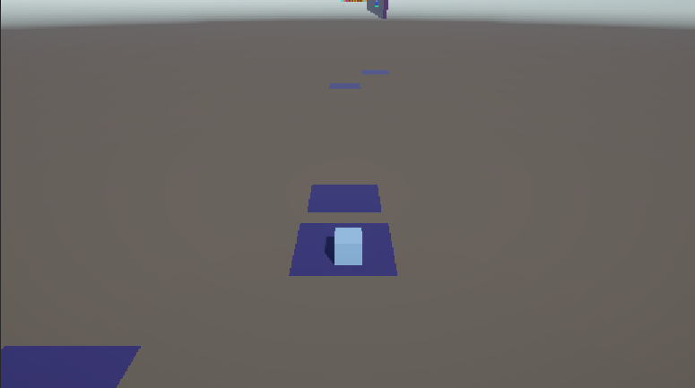
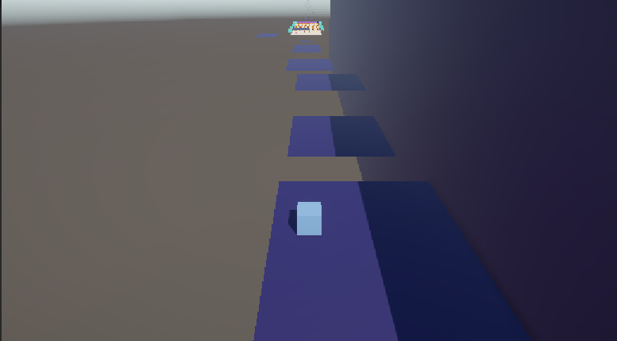
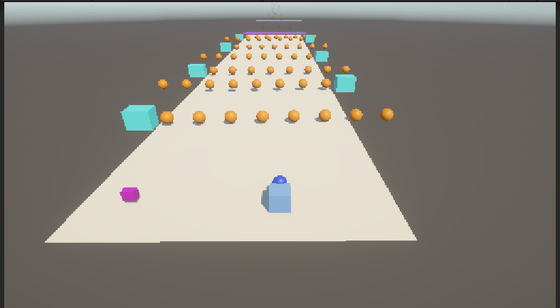
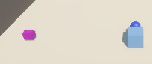
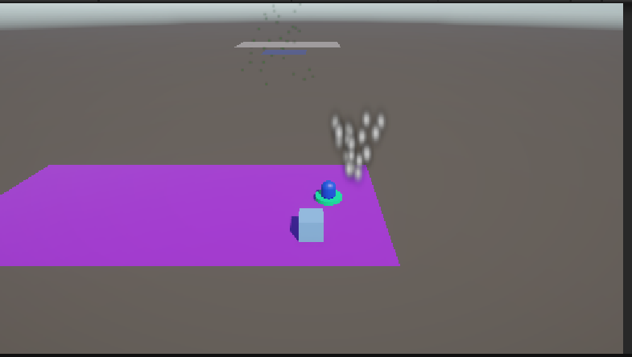
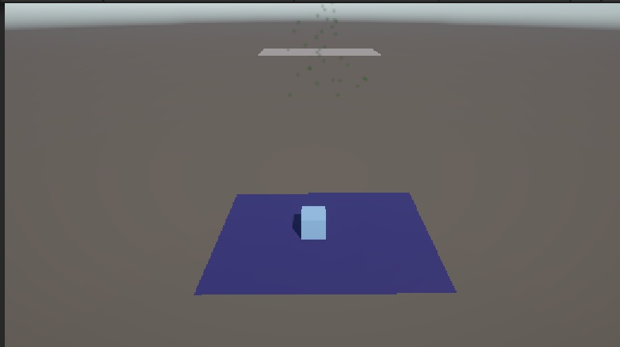

#  Parkour 3D: [Escape de Unity] 

> **Asignatura:** Programación de Videojuegos I 
> **Carrera:** Tecnicatura Universitaria en Diseño Integral de Videojuegos (TUDIVJ) — UNJu 
> **Trabajo Práctico N° 1:** Entorno Interactivo 3D, Temporizadores y Git/GitHub 
> **Estudiante:** [Tolaba Tiago] 
> **LU:** [000834] 
>**Equipo Docente:** Mg. Ing. Ariel Alejandro Vega | Tecn. Kevin Alexis Roman Llampa 
--- 
## 🎮 Descripción del Proyecto  

Un juego de plataformas 3D donde el jugador debe completar un circuito de parkour de 2 niveles hasta llegar a la meta. Supera las plataformas, esquiva obstaculos y entrega un objeto dandole la victoria.
--- 

## 🕹️ Controles del Jugador 
| Acción | Tecla / Botón | Descripción | 
| :--- | :--- | :--- | 
| **Movimiento** | `W`, `A`, `S`, `D` / Flechas | Mover al personaje por el escenario | 
| **Salto** | `Espacio` | Saltar entre plataformas | 
| **Interactuar / Recolectar** | `E` / Contacto con zona(`Trigger`) | Recolectar el objeto clave o activar Power-Up | 

--- 
## ⚙️ Mecanicas
- **Plataformas moviles**

El Juego contiene plataformas que se desplazan de punto A hacia punto B. El movimiento es continuo y se utiliza ```Invoke()``` para temporizar el cambio de direccion

- **Proyectiles**
El escenario cuenta con un generador de proyectiles (```BulletSpawner```) que utiliza ```InvokeRepeating()``` para instanciar balas que chocan con el jugador. Se destruyen despues de un tiempo para evitar una acumulacion de objetos

- **Recoleccion**
El jugador puede recoger un objeto presionando E. Al recogerlo el jugador se emparenta mediante ```SetParent()``` permiento transportarlo durante el recorrido. Al llegar a la zona de entrega, el objeto deja de ser transportado por el jugador y pasa a formar parte de la zona de entrega

- **PowerUp: Velocidad**
Durante el recorrido se encuentra un PowerUp, un cubo rosa. Al tomarlo, el jugador obtiene un x5 en velocidad por un tiempo limitado. El efecto dura 8 segundo y se implementa mediante una corrutina ```Power Up de Velocidad```. Al finalizar el tiempo, vuelve a su estado original

- **Niveles**
El juego esat dividido en dos niveles. En el primer nivel se debe superar plataformas. En el segundo nivel aumenta la dificultad teniendo que esquivar obstaculos despues de superar nuevas plataformas en las paredes y se agrega el objeto a entregar. Al cumplir el objetivo gana el juego

- **Victoria**
Al completar el objetivo, se muestran efectos visuales de particulas
___

## 📝 Explicacion Tecnica de Codigo:
1. ### Escenario y control del personaje
Script principal: ```PlayerMovement.cs```
Funcionamiento: El script controla el movimiento y el salto del personaje mediante el teclado y utiliza un Rigidbody para aplicar la fuerza de salto

```csharp
  void Update()
 {
     // MOVIMIENTO
     float h = Input.GetAxisRaw("Horizontal");
     float v = Input.GetAxisRaw("Vertical");

     dir = new Vector3(h, 0f, v);

     Vector3 mover = dir.normalized * walkSpeed * Time.deltaTime
                   + externalMoveSpeed * Time.deltaTime;

     transform.Translate(mover, Space.Self);

     // SALTO
     if (Input.GetKeyDown(KeyCode.Space) && isGrounded)
     {
         rb.AddForce(Vector3.up * JumpForce, ForceMode.Impulse);
     }

     Debug.Log($"H:{h} V:{v}");
 }
```

2. ### Plataforma movil e ```Invoke()```
Script principal: ```MovingPlatform.cs```
Funcionamiento: El Script mueve las plataformas de Punto A a Punto B y se utiliza ```Invoke()``` para temporizar el cambio de direccion

```csharp
   void Update()
   {
      float distanceToTarget = Vector3.Distance(transform.position, currentTarget); // Distancia entre la plataforma y el punto al que quiere llegar

      if (distanceToTarget < proximityThreshold && !waiting)
    {
    transform.position = currentTarget;
    waiting = true;
    Invoke("ChangeDirection", waitTime); // Espera para volver 
    }
// Calcula la direccion de la plataforma al objetivo y lo mueve hacia el objetivo
dir = (currentTarget - transform.position).normalized;
transform.position += dir * speed * Time.deltaTime;
   }

   private void ChangeDirection()
   {
       currentTarget = currentTarget == pointA.position ? pointB.position : pointA.position;
       waiting = false;
   }
```

3. ### Generador de obstaculos e ```InvokeRepeating()```
Script principal: ```BulletSpawner.cs```
Funcionamiento: El Script genera balas mediante ```InvokeRepeating()```

```csharp
   private void Start()
   {
       InvokeRepeating("ShootFast", initTime, interval);
   }

   public void ShootFast()
   {
       GameObject newBullet = Instantiate(bullet, transform.position, transform.rotation);
       Destroy(newBullet, 4f);
   }
```

4. ### Recoleccion y transporte mediante ```SetParent()```
Script principal: ```PickItem.cs```
Funcionamiento: Se utiliza para recoger el objeto y emparejarlo

```csharp
   private void Pick(GameObject item)
{
    currentItem = item;

    item.transform.SetParent(zone);
    item.transform.localPosition = Vector3.zero;
    item.transform.localRotation = Quaternion.identity;

    Collider collider = item.GetComponent<Collider>();
    if (collider != null) collider.enabled = false;
}

public GameObject DropItem()
{
    GameObject temp = currentItem; // Guarda temporalmente el item actual
    currentItem = null; // Deja de llevar el objeto
    return temp; // Devuelve el item
}
```

5. ### Potenciador temporal con corrutina
Script principal: ```PowerUpSpeed```
Funcionamiento: El Script maneja la activacion del PowerUp
### PowerUpSpeed.cs

```csharp
   private void OnTriggerEnter(Collider other)
{
    if (other.CompareTag("Player"))
    {
        PlayerMovement player = other.GetComponent<PlayerMovement>();

        if (player != null)
        {
            player.EnableSpeedBoost(extraSpeed);
        }

        Destroy(gameObject);
    }
}
```

### PlayerMovement.cs

```csharp
   private IEnumerator SpeedBoost(float extraSpeed)
 {
     speedBoostActive = true;

     walkSpeed += extraSpeed;

     Debug.Log("<color=green>VELOCIDAD AUMENTADA</color>");

     yield return new WaitForSeconds(speedBoostDuration);

     walkSpeed -= extraSpeed;

     speedBoostActive = false;

     Debug.Log("<color=red>VELOCIDAD NORMAL RESTAURADA</color>");
 }

 public Vector3 ExternalMoveSpeed
 {
     get => externalMoveSpeed;
     set => externalMoveSpeed = value;
 }
```

6. ### Entrega del objeto y evento de victoria
Script principal: ```GoalZone.cs``` y ```MetaBehavior.cs```
Funcionamiento: El ```GoalZone.cs``` se utiliza para la entrega del objeto y activael camino a la meta. ```MetaBehavior.cs``` cambia de color la plataforma y activa particulas.

### GoalZone.cs
```csharp
       if (other.CompareTag("Player") && !completed)
{
    PickItem pickItem = other.GetComponent<PickItem>();
    if (pickItem != null)
    {
        GameObject item = pickItem.DropItem(); // Deja el objeto que tiene el jugador

        if (item != null)
        {
            ItemInZone(item); // Coloca al item en la zona de entrega
            Debug.Log($"<color=green>El Objeto esta en su lugar!</color>");
            completed = true;
            particles.Play();
        }
        else
        {
            Debug.Log($"<color=red>Falta el Objeto</color>");
        }
    }
}

    private void ItemInZone(GameObject item)
{
    item.transform.SetParent(goal);
    item.transform.localPosition = new Vector3(0f, 5f, 0f);
    item.transform.localRotation = Quaternion.identity;

    Collider collider = item.GetComponent<Collider>();
    if (collider != null) collider.enabled = true;
}
```

### MetaBehavior.cs

```csharp
   private void OnTriggerEnter(Collider other)
{
    if (other.CompareTag("Player"))
    {
        Debug.Log("<color=greenYellow>GANASTE!!! Felicidades, lograste sobrevivir</color>");
        
        GetComponent<Renderer>().material.color = Color.greenYellow; // Cambia el color a verde 
        Particle.Play();
    }
}
```
___

## 📸 Capturas de Pantalla
### Nivel 1



### Nivel 2






### Victoria



___

## ▶️ Como abrir y ejecutar el proyecto

1. Descargar o clonar el repositorio desde GitHub.
2. Abrir Unity Hub.
3. Seleccionar **Add project from disk** y elegir la carpeta del proyecto
4. Abrir el proyecto utilizando **Unity 6.3 LTS**
5. Abrir la escena principal ubicada en `Assets/Scenes/`
6. Presionar **Play** para ejecutar el juego
7. Utilizar los controles indicados en la seccion **Controles del Jugador**
___
## 📚 Bibliografia
- [README.md - Markdown](https://markdown.es)
- [Plataformas moviles - Youtube](https://www.youtube.com/watch?v=AoLR6pMkkZQ)